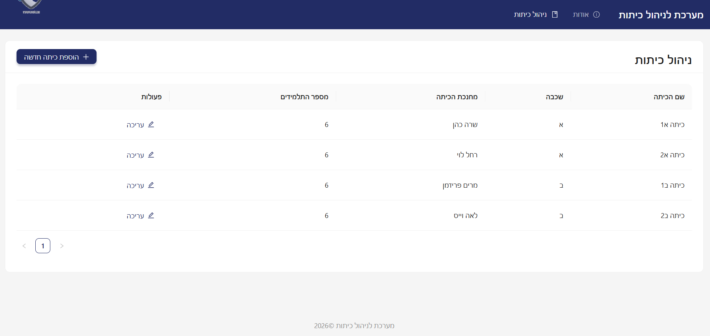
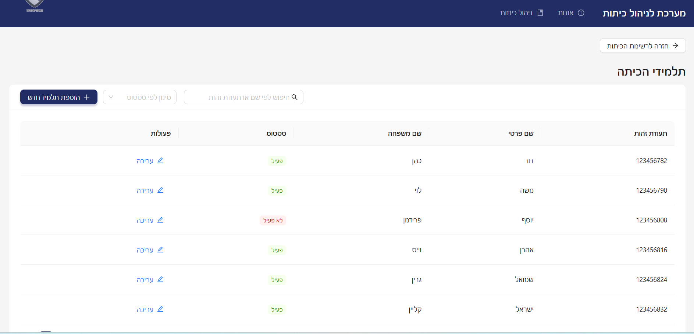
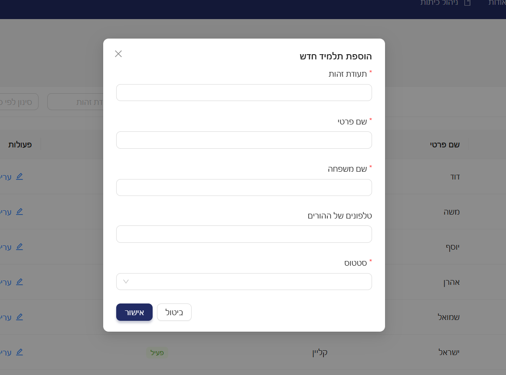
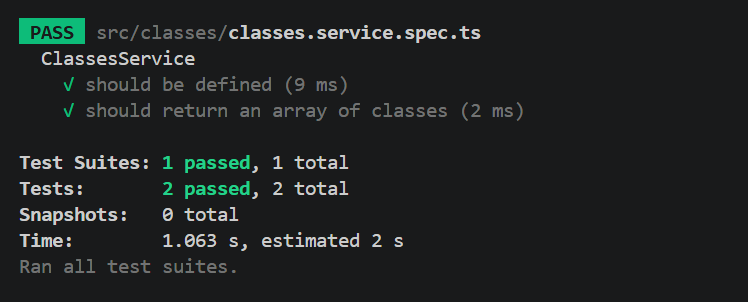

# 🏫 School Management System

מערכת לניהול כיתות ותלמידים, הבנויה בארכיטקטורת Full-Stack מלאה וכוללת שרת NestJS ולקוח React (TypeScript).


---


## 🖼️ תצוגת המערכת (Screenshots)


| מסך כיתות | מסך תלמידים |
| :---: | :---: |
|  |  |


| דיאלוג טופס גנרי (Modal) | תוצאות בדיקות היחידה (Tests) |
| :---: | :---: |
|  |  |


---


## 🚀 הוראות הרצה (Client & Server)


### דרישות מוקדמות

* **Node.js** (גרסה 18 ומעלה)

* **npm**


### 1. הרצת ה-Backend (Server)

```bash
cd backend
npm install
npm run start:dev

השרת יעלה כברירת מחדל בכתובת: http://localhost:3000


2. הרצת ה-Frontend (Client)
Bash
cd frontend
npm install

npm run devהלקוח יעלה כברירת מחדל בכתובת: http://localhost:5173


3. הרצת בדיקות יחידה (Unit Tests)
Bash
cd backend
npm run test🧪 בדיקות יחידה (Unit Tests)
בדיקות היחידה נכתבו בעזרת Jest עבור ה-ClassesService בשרת.
הבדיקות מוודאות את אתחול הסרוויס ושליפת הנתונים בצורה מבודדת ותקינה.


🏗️ מבנה הפרויקט
Plaintext
├── backend/                  # NestJS Framework
│   ├── src/
│   │   ├── classes/          # מודול כיתות, סרוויס ובדיקות יחידה (spec.ts)
│   │   ├── students/         # מודול תלמידים
│   │   └── main.ts
│   └── package.json
│
└── frontend/                 # React + TypeScript (Vite)
    ├── src/
    │   ├── components/       # רכיבי UI גנריים (GenericTable, GenericModel)
    │   ├── services/         # RTK Query API slice לקריאות שרת
    │   ├── pages/            # דפי האפליקציה (ClassesPage, StudentsPage)
    │   ├── types/            # הגדרות Type-Safety
    │   └── App.tsx           # הגדרת ראוטינג ו-ConfigProvider מרכזי
    └── package.json


## 🧠 החלטות מרכזיות שהתקבלו במהלך הפיתוח

אחידות ויזואלית מבוססת Theme מרכזי (Design Tokens):
במקום להגדיר סטיילים קשיחים ברמת הרכיבים הבודדים, ריכזנו את כל עיצוב ה-UI ב-ConfigProvider של Ant Design ברמת ה-App.
החלטה זו מונעת כפילויות עיצוב, מבטיחה שפה ויזואלית אחידה לכל המערכת, ומאפשרת שינוי מראה מקיף במקום אחד בלבד.
הפרדת אחריות מלאה ב-Frontend (Layered Architecture):
הקפדנו על הפרדה ברורה בין שכבת התצוגה (Pages & UI Components), שכבת ה-Types (ממשקי TypeScript), ושכבת ה-Data Fetching (סרביסים של RTK Query).
הפרדה זו שומרת על הקוד קריא, מקלה על תחזוקה, ומאפשרת לבדוק ולפתח כל חלק בנפרד.
כתיבת בדיקות יחידה ממוקדות ב-Backend:
בחרנו לממש את בדיקת היחידה (Unit Test) בשרת עבור ה-ClassesService.
ההחלטה להתמקד בבדיקת השירות (Service Level) מבטיחה אימות מבודד של ה-Business Logic והאתחול, ללא תלות בתשתיות חיצוניות, תוך שמירה על זמן הרצה מהיר.
חווית משתמש וטיפול במצבי קצה (UX & Loading States):
שילבנו אינדיקטורים ויזואליים של טעינה (isLoading) וטיפול בדיאלוגים (Modals) בצורה שמגנה על המשתמש מטעויות (כמו כפילות בלחיצה על טפסים), כדי להבטיח אינטראקציה חלקה וברורה בכל פעולת CRUD.

## 🔮 שיפורים שהייתי מוסיפה אילו היה זמן נוסף


**חיבור למסד נתונים אמיתי (Persistent Database):**
  * מעבר מניהול נתונים בזיכרון (In-Memory Array) לעבודה מול דאטאבייס אמיתי (כגון PostgreSQL / MongoDB) באמצעות ORM (כמו Prisma או TypeORM).
  * יאפשר שמירת נתונים קבועה, ביצוע שאילתות מורכבות וניהול יחסים (Relations) בין כיתות לתלמידים.


**הרחבת יכולות המערכת (Product Features):**
  * הוספת מסכי ניהול מתקדמים (כגון: צפייה בלוח שעות שבועי, שיבוץ מורים לכיתות, ומעקב נוכחות תלמידים).
  * דאשבורד מרכזי עם סטטיסטיקות (כמות תלמידים ממוצעת בכיתה, התפלגות לפי שכבות גיל).


**חווית משתמש (UX):**
  * מנגנון השהייה (Debounced Search) בתיבת החיפוש בטבלאות, כדי למנוע קריאות רשת מיותרות בזמן הקלדה.


**בדיקות מקיפות:**
  * כתיבת בדיקות מקצה לקצה (E2E) המכסות את זרימת הנתונים המלאה מה-Client ועד ה-Database.

